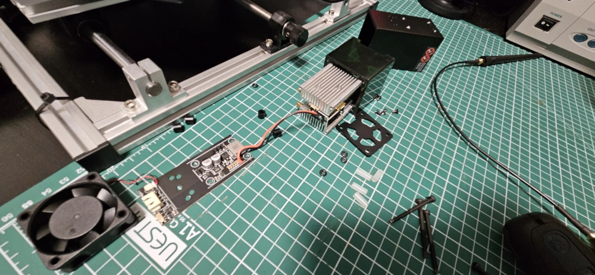
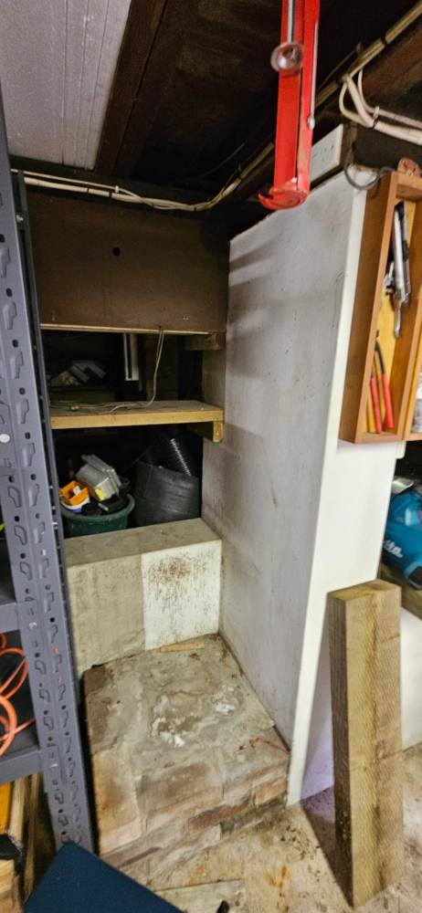

# CNC Engraver Laser Upgrade

This page provides the notes and narrative regarding my successful August 2024 upgrade of an inexpensive CNC kit.

The precise model was __S3018 CNC Engraving Machine__ from __Vevor__ ([website](https://www.vevor.com.au/s/cnc)) but there are many models that are similar, some people call them '2030 kits' or something similar, referring to the nominal bed size. Basically they are cheap base-grade CNC platforms, usually without limit switches, homing switches, probes, tool change, covers, alarms, E-stops, interfaces, or enclosures.

My experiences are probably relevant to you if you have any kind of similar system.

In short, I would recommend changing from engraving to laser as it's an excellent upgrade and a process much more suited to lightweight CNC machine frames and drive systems than engraving is.

## Back story

I had been planting many plants in the garden and needed a way to label them neatly where I could preserve the species identification instead of having to memorize 100s of latin names.

As much as I have fond memories of my high school Latin teacher and can't fault either pizza or Tuscan desserts as a food group, there's no way that stuff was going to stick in my mind, and I'm partial to the botanic garden.

Therefore when I saw an ER-11 collet CNC engraver kit pop up from 2020 aluminium for around $100, I thought it'd be worth buying as a small project.

### 2023 Assembly

The system was pretty quick to assemble, being based upon hex driven screws, cast aluminium brackets and not having anything so exotic as cable management.

Getting it to function was a different story.

There were a number of issues, such as:
 * Presumption that the user wanted to run software on Windows (I use [Gentoo Linux](https://www.gentoo.org))
 * Lack of a suitable precision clamping solution for small labels
 * Extremely noisy (like an aircraft taking off) due to undampened vibration and the lightness of the frame
 * Needing to wade in to GCode to figure out the right preamble to get the thing to operate
 * Non-flat bed, even after measurement, shims, and time investment.

In the end I solved the issues well enough to get some use out of the thing, and carved out maybe 40-50 labels then put the thing away for a year.

For reference, my solutions were:
 * Software:
   * Use [Inkscape](https://inkscape.org/) for drawing an initial SVG
   * Use [svg2gcode](https://github.com/sameer/svg2gcode) to convert to gcode after figuring out the right preamble
   * Use [cncjs](https://cnc.js.org/) as a web-based interface to send commands to the GRBL controller included with the machine over the serial USB interface
 * Precision clamping:
   * Use two long steel rulers (since they are of uniform thickness and relatively strong) to transfer clamping force from the four t-clamps or step-clamps included evenly along both horizontal edges of the thin cards I wanted to work with
 * Noise:
   * Run the thing in the day time only, back to back, then put it away to minimize the ire of neighbours
 * GCode hassles:
   * Try various GCode generators until it did what I wanted, then reverse engineer the differences.
 * Flatness:
   * Give up on obtaining a flat table and just use an area near the center that was determined 'flat within acceptable tolerance'.

If I were to do consider a similar kit in future, I would anchor it to a piece of solid timber instead of just the aluminium frame, and I would cover it with a box for audio insulation. But basically, I wouldn't buy a kit again, I'd build from scratch because I now have the confidence that would result in a better system.

## 2024 Upgrade

In winter 2024 I noticed 12V "80W laser" units very cheaply and decided to give an upgrade a go, having noted that the control board (running a version of GRBL) had a laser port.

The upgrade took about a day all told. This repository is intended to document the process.

### Challenges

The main problems were as follows:

 * __Cable polarity mismatch__
   * It became apparent that the Vevor S3018 CNC Engraving Machine's GRBL controller had the opposite polarity to the laser, namely PWM-GND-12V instead of 12V-GND-PWM.
   * To try to get to the bottom of this I opened it up to see if its documentation matched the board or not. It went back together less a few pieces but functioned perfectly.  
 * __Mounting mismatch__
   * The laser kit came with a very loose and imprecise miniature guideway kit for manual height adjustment, consisting of a track and a guided mountpiece, however the hole spacings on either piece did not appear fit either the laser (except two holes which is insufficient, noting that the supplied screws did not actually function to bond those two items due to length constraitns) or on the engraving machine (which came with a pre-molded rounded polymer head / Z axis assembly for the ER-11 collet spindle).
 * __Undocumented GRBL version__
   * There was no documentation available for the upgrade because there was very little information available about the controller.

### Solutions

 * __Cable fix__
   * The suppled cable was a JST-XH 2.54mm series and could not be reserved owing to the polarity fixing fins present on the connectors, ruling out just shoving it in backwards.
   * Unfortunately, instead of using the cheap connectors (thin white polymer box) they had used expensive connectors (harder polymer with embedded metal pins) which was annoying because my standard solution in this case is to rip off part of the XH connector so I can insert the thing backwards. It's the brown connector in the upper right of this image I found on the internet. 
   * I therefore tried to hack off the outside of the thing with precision plyers but unfortunately wound up ripping out the central (GND) pin in the process.
   * Finally, I opted to directly solder the cable line to PWM and 12V and instead of demounting the whole boards and unsoldering the connector and replacing it with another 3 pin connector (such as a 2.54mm screw terminal), I just soldered in place and soldered the ground to a nearby connector also exhibiting GND from the same controller.  
   * Since the resulting solution was hacky at best, knowing I was never going to further modify or resuscitate this aged controller, I created some ad-hoc cable stress relief using wire ties, some electrical tape stuffed in the voids and a tonne of superglue.
   * It worked!
   * Before plugging in the laser I connected the lines to an oscilloscope and verified that GRBL commands would set the [pulse-width modulation](https://en.wikipedia.org/wiki/Pulse-width_modulation) level appropriately. The specific test commands were `G1 S0` (laser off) through `G1 S100` (10% laser power), `G1 S500` (50% PWM for half laser power) and `G1 S1000` (100% PWM for full laser power).       
 * __Mounting fix__
   * I realised that the primary requirements for the laser mounting were:
     1. Approximately perpendicular to the work surface; and 
     2. Ideally CNC-adjustable height from the surface.
   * While it was theoretically possible to rip the spindle out entirely and replace it with the laser, this didn't really strike me as a fun exercise and I wasn't sure if I might want to use it in future. Here's an image of a similar system with only laser (no ER-11 spindle). 
   * Because the upper portion of the Z-axis assembly was not really presenting a suitable flush mounting surface, my solution was hacky but effective:
     * First evaluate the recommended height-from-surface from the laser kit (8mm)
     * Next plaster the edge of the laser in double-sided tape 
     * Finally, zip-tie the thing to add some further structural support.
   * The result appeared almost completely rigid which is probably not what you want (total rigidity helps to maintain straight cuts with high acceleration motion) but since the laser is extremely light it doesn't seem to matter. Perhaps a higher rigidity upgrade to this mounting could be attempted in future, maybe via a 3D printed bracket or one of those metal pipe tie-down strips.  
 * __GRBL hassles__
   * The laser can be enabled by running `$32=1` to turn on 'laser mode'.
   * It is then necessary to set the laser power using `S<number>` meaning 'spindle-speed' (or 'tool power') where `<number>` on some other controllers ranges from 0-255 but on GRBL appears to range from 0-1000. Note that, according to my very light analysis with no authoritative reference, the tool is only enabled with in `G1` modes ("move with tool on"), whereas the default `G0` modes ("move with tool off") will not enable the laser.
   * I did try some GCode from a few sources again until I got an initialization sequence that worked for me.

## Early tests

A few early tests with card including burn-through, failure to turn off laser and failure to move.

## Tweaking

Once it was all up and running I performed the following additional testing and configuration.

 * __Height tests__
   * I compared the effectiveness of the laser using manual height adjustments but the same program code. My conclusion was that the laser was roughly most effective within a 2-3mm window around the manufacturer's recommended distance from the work surface, which is 8mm, but perhaps toward the lower end (like 6mm). While the qualitative differences are not major at a glance, they are easy to notice up close. The lower right example in this image was the 'tuned' or improved version, anyway near enough for my purposes. 
 * __Speed tests__
   * I definitely wanted to improve the speed as the initial tests used the same speed of motion that I had been using for engraving, ie. ungodly slow.
   * There is rather a lot of complexity here, but basically:
     * When GRBL moves it has multiple sets of its own internal speed limits, and in addition there is motion speed set within the program, and in addition each axis has a motor which will begin to exhibit irregular motion if its maximum pulse rate is exceeded.
     * The only real way to perform such a test is to run the same program over and over again modifying a single variable each time and re-evaluating the results.
   * The conclusion of my tests were that it was certainly possible to greatly improve speeds. The main steps necessary were:
     * Increase the axis motion limits within the GRBL firmware settings, which can be viewed with `$$`
     * Specifically, be sure to increase the X and Y axis speeds with `$110=2000`, `$111=2000` and (if you care about Z) `$112=2000`.
     * Additionally, be sure to increase the acceleration limits with `$120=200`, `$121=200`, and (if you care about Z) `$122=200`.
   * A friend of mine suggested that it is normal to run these lasers in 'raster mode' making multiple passes in order to effect a 
   * Ensure your GCode generator is using 2000 or 3000 speeds.
 * __Fumes__
   * One issue with the old engraving approach was that little bits of black plastic wound up flying everywhere which was a huge pain to clean up and really annoying. The issue with the laser approach is that little bits of black plastic are vaporised and if you breathe them in you will surely become ill and get cancer. Therefore, it is necessary to operate the machine in good ventilation or (preferably) with a full control fume hood. I tried to use a couple of bench fans to direct the exhaust out the window but this was not very effective. Getting slightly more serioues I found a plastic box that was exactly the right size to fit over the machine. If I have to run it inside again I can use the fume hood. However, medium term I will connect this to a fume extraction system as a resuble fume hood both for this machine and for other potential uses (superglue/epoxy, chemistry, soldering).  
 * __Workpiece alignment process__
   * One of the annoyances with the combination of __cncjs__ and the old __GRBL-based controller__ is that the 're-home' button to zero-out machine offsets is not an implemented command.
   * This means that, once you put a workpiece down, then jog the machine over the top, the only way to zero-out the machine is to physically reset the controller by pushing the reset button or performing a power cycle. This is annoying both because it's mounted behind the machine and because fat-fingering the controller board is a winning strategy for destroying it with oily goop and cable stress. No fix for this one, unfortunately.
   * The improved process is as follows.
     * First, manually twist the control knobs to jog the machine to a 'roughly center' location. Note that this is very general only and need not be accurate as its main function is to ensure the machine does not hit the axis limits when sent to the corner of the workpiece (which anyone who has built low-end CNC gear will instantly recognise as a 'crunch crunch' sound causing them to panic and seek to yank the power cord since they were too cheap to fork out for the elegant high-tech solution of an [e-stop or kill switch](https://en.wikipedia.org/wiki/Kill_switch)!)
     * Secondly, place the label beneath the laser head, being sure to align the label with one of the aluminium T-slots on the work table (or a reference mark on the work table if your worktable is flat).
     * Thirdly, tweak the laser head's position on the Y axis to match the label's.
     * Fourth, fat-finger the GRBL controller's reset button to zero the axes.
     * Finally, upload your gcode to the machine and press run.
   * Overall here we should note the laser head is a lot easer to align with the workpiece than the old ER-11 collet was, as it is the same height on the Y axis as the label itself, and slightly shorter on the X axis and hangs very close to the surface on the Z axis. 
   * Note that this ties in to the improved software workflow, documented below.

## Improved software workflow

As mentioned, previously the approach used to get code to the engraver was to store an inkscape drawing to SVG, convert that to a GCode file using svg2code, then upload with cncjs.

The improved process is to use the [JTech Photonics Laser Tool](https://github.com/JTechPhotonics/J-Tech-Photonics-Laser-Tool) plugin for InkScape which has a nice simple UI.  Alternatively, InkScape now apparently includes be default `Extensions > Gcodetools` which can probably do the same thing.

Here's how I set it up.

 * First, install the extension by following the instructions on the Github page.
 * Second, experimentally determine the appropriate speed settings (see 'Speed tests' note, above) for each axis. For my purposes, given the light weight and small nature of the frame, the low torque lasers require versus milling machines, just assume X and Y are the same and max the figures out to 2000 or 3000. Note that when testing you may wish to pay attention separately to straight lines on either axis and to text. I actually found that high speeds yielded better results for text (after clearing off the workpiece with an alcohol wipe) but worse results in the middle of long horizontal lines where acceleration had greatly increased, whereas the inverse of slow speeds yielded poor text results and lovely straight lines. You could probably optimize these with a good GCode generator, some post-processing, or multiple files in succession to a single workpiece. It's not a perfect science, find what works for you.
 * Third, and this is the real winner making the whole workflow tie together quite nicely, configure your offsets.
   * The last tab of the JTech Photonics laser tool dialog has specific offsets for each axis.
   * The gcode generation seems to yield random offsets which result in cncjs wanting to advance many centimeters from the home position before burning.
   * The basic process is to generate gcode, bring it in to cncjs, and see how far it lies from the origin.
   * Your objective is to make the gcode appear exactly over the origin.
   * Once this has been done, the whole process becomes easy because you can visually align the workpiece with the laser head and press go and know that everything will work perfectly.

## Conclusions

 * The laser workflow is much better than the engraving workflow.
   * Easier workpiece placement
   * Easier alignment
   * Faster cycle times (~4x faster)
   * Much cleaner workspace (once fumes are handled)
   * Nearly no noise
 * Currently, even though I must admit qualitatively the engraved pieces are slightly nicer (shinier), this difference is not significant and could probably be improved by a second pass. You can see a comparison in this image. While the image is quite bad, the important point is both are similar. If you look closely despite the poor photography you can see that in the upper-left of the right (engraved) image, the text was not engraved correctly ... this was a major issue with the imprecision of the bed (not being perfectly flat despite tuning and shims) in the old engraving process. 
 * Any form of CNC engraving or milling machine should be of heavy construction, using solid metal or something of similar density, not lightweight structures which are at best useful demonstrations as teaching/learning tools for building confidence in mechatronic systems concepts. If you find yourself with such a platform, modifying it to use laser is a great idea as this removes most of the problems of the lightweight and imprecise construction.
 * My biggest issue remaining is finding a permanent place for the laser in order to pipe the fume hood for fume extraction. I cleaned out an area under the house for this but am going to need to do some construction work before it's done.
 Currently the laser is awaiting the construction of an appropriate work surface.  
 * To still further improve fume extraction, it should be possible to implement a 'shoe' over the end of the laser to catch fumes as they are generated. This should be a good 3D printing project.

